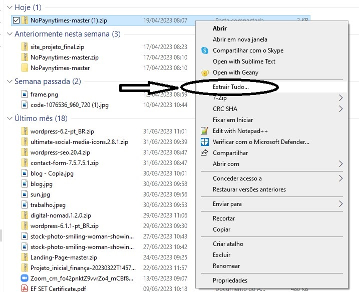
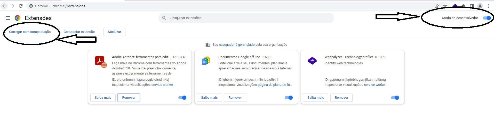
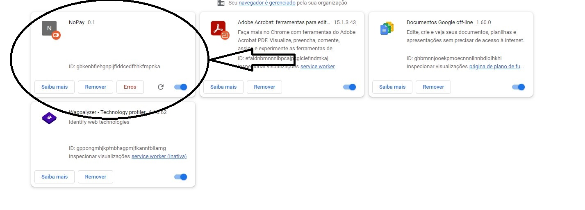
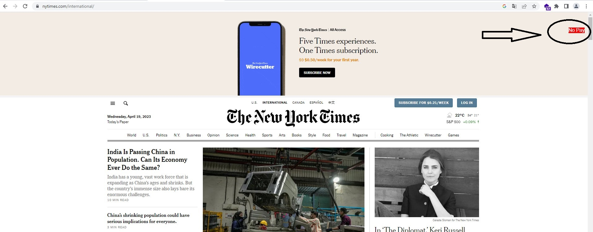
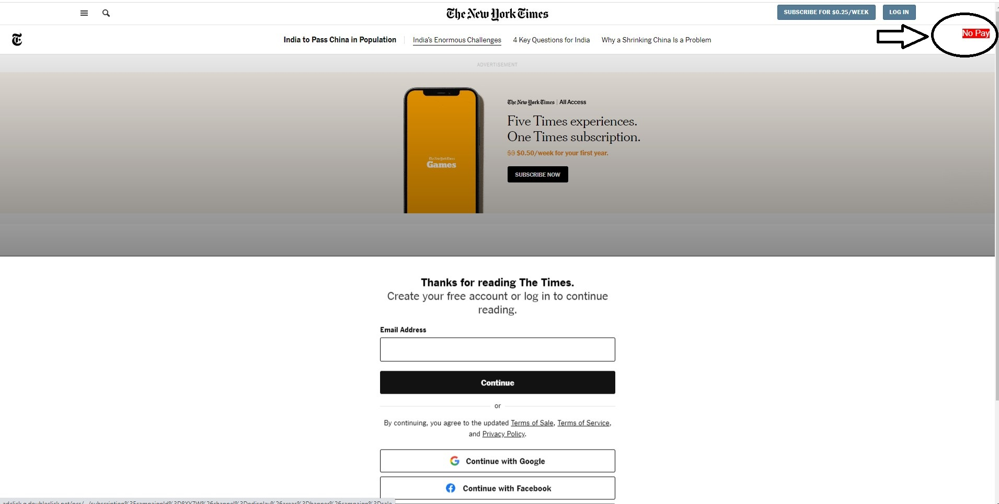

<h1 align="center">No Pay The New York Times</h1>

Don't pay or login for see notice in the New York Times

If you've never used github, just use step by step to read your news in the New York Times.

<strong>1 - Download this file to your computer</strong>

<strong>2 - Extract the .zip file</strong>

<strong>3 - In google chrome type "chrome://extensions" Enable "developer mode" and click "load without compression"</strong>

<strong>4 - Select the folder where the file is located. needs to be the folder before the file. if you select the wrong folder it will not work</strong>

<strong>5 - Go to the new york times website. If you followed the complete step by step, a red "No pay" button appeared on the website.
When the popup appears just click the button and it will disappear</strong>

<h2>💻Tools</h2>

- JSON 

- JAVASCRIPT 

- CSS 

- GIT e GitHub 

<h2>📱Contact</h2>

viktorariel777@gmail.com

